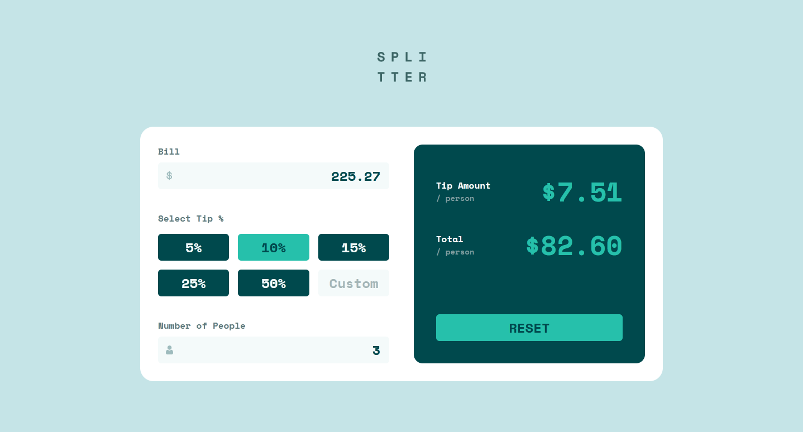
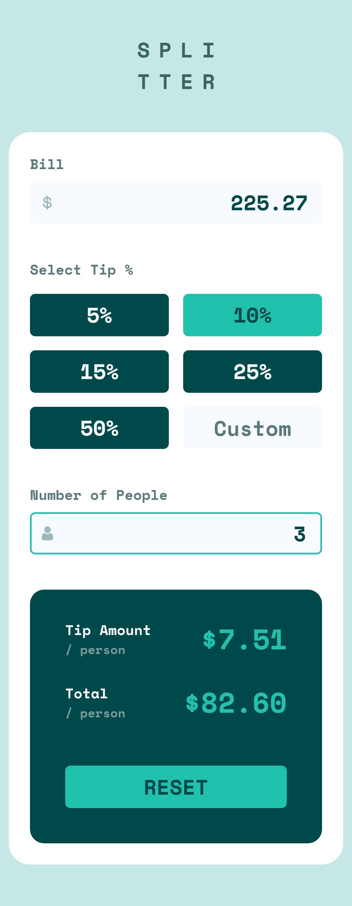

# Frontend Mentor - Tip calculator app

This is a solution to the [Tip calculator app challenge on Frontend Mentor](https://www.frontendmentor.io/challenges/tip-calculator-app-ugJNGbJUX). Frontend Mentor challenges help you improve your coding skills by building realistic projects.

## Table of contents

- [Overview](#overview)
  - [The challenge](#the-challenge)
  - [Screenshot](#screenshot)
  - [Links](#links)
- [My process](#my-process)
  - [Built with](#built-with)
  - [What I learned](#what-i-learned)
  - [Continued development](#continued-development)
  - [Useful resources](#useful-resources)
- [Author](#author)
- [Acknowledgments](#acknowledgments)

## Overview

### The challenge

Users should be able to:

- View the optimal layout for the app depending on their device's screen size
- See hover states for all interactive elements on the page
- Calculate the correct tip and total cost of the bill per person

### Screenshot

### Links

- Solution URL: [Solution](https://www.frontendmentor.io/solutions/order-summary-component-TkS_Qmir9)

## My process

### Built with

- [React](https://reactjs.org/) - JS library
- [Chakra UI](https://chakra-ui.com/) - For styles

### What I learned

- Lot about state management
- Reusable components
- More understanding about callbacks
- Conditional rendering (Nested ternary)
- More understanding about flexbox & grid

### Continued development

### Useful resources

## Author

- Website - [Viraj Kanase](https://virajkanse.github.io/)
- Frontend Mentor - [@VirajKanse](https://www.frontendmentor.io/profile/VirajKanse)

## Acknowledgments
